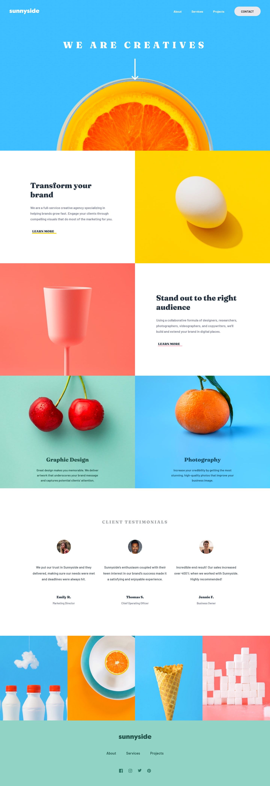

# Frontend Mentor - Sunnyside agency landing page solution

This is a solution to the [Sunnyside agency landing page challenge on Frontend Mentor](https://www.frontendmentor.io/challenges/sunnyside-agency-landing-page-7yVs3B6ef). Frontend Mentor challenges help you improve your coding skills by building realistic projects.

## Table of contents

- [Overview](#overview)
  - [The challenge](#the-challenge)
  - [Screenshot](#screenshot)
  - [Links](#links)
- [My process](#my-process)
  - [Built with](#built-with)
  - [What I learned](#what-i-learned)
  - [Continued development](#continued-development)
- [Author](#author)

## Overview

### The challenge

Users should be able to:

- View the optimal layout for the site depending on their device's screen size
- See hover states for all interactive elements on the page

### Screenshot

### Links

- Solution URL: [Github](https://github.com/Absynthee/sunnyside-agency-landing-page-main)
- Live Site URL: [Github Pages](https://absynthee.github.io/sunnyside-agency-landing-page-main/)

## My process

### Built with

- Semantic HTML5 markup
- CSS custom properties
- Flexbox
- CSS nesting
- Javascript
- jQuery

### What I learned

I managed to complete this challenge much quicker than the last one, so I added more quirks to the design to spruce up the interactive aspect of the site, making it more fun and playful. Nothing was too difficult, except the javascript as I'm still in the process of learning that. 

### Continued development

It would be nice to learn more about how to use javascript for the mobile nav bar. I feel like my setup for it is very basic and could be improved upon.

## Author

- Website - [Austin Spillman](https://www.austinspillman.com)
- Frontend Mentor - [@Absynthee](https://www.frontendmentor.io/profile/Absynthee)